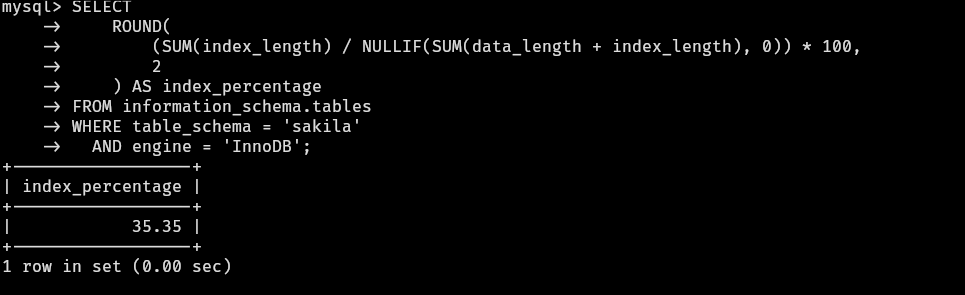

# Домашнее задание к занятию "Индексы" - Валик Александр


### Задание 1
Напишите запрос к учебной базе данных, который вернёт процентное отношение общего размера всех индексов к общему размеру всех таблиц.



 ----

### Задание 2

Выполните explain analyze следующего запроса:

```sql
select distinct concat(c.last_name, ' ', c.first_name), sum(p.amount) over (partition by c.customer_id, f.title)
from payment p, rental r, customer c, inventory i, film f
where date(p.payment_date) = '2005-07-30' and p.payment_date = r.rental_date and r.customer_id = c.customer_id and i.inventory_id = r.inventory_id
```
*    перечислите узкие места;
*    оптимизируйте запрос: внесите корректировки по использованию операторов, при необходимости добавьте индексы.

Проблемы (узкие места):

1. Использование FROM payment p, rental r, customer c, inventory i, film f без явных условий создает временную таблицу со всеми комбинациями.
2. Функция DATE() на индексированном поле блокирует использование индекса.
3. Нет условия i.film_id = f.film_id, поэтому каждый платеж соединяется со всеми фильмами.
4. SUM(...) OVER(...) вычисляется для каждой строки, что создает огромные временные таблицы.

```sql
USE sakila;

SELECT 
    CONCAT(c.last_name, ' ', c.first_name) AS customer_name,
    SUM(p.amount) AS total_amount
FROM payment p
JOIN rental r ON p.rental_id = r.rental_id
JOIN customer c ON r.customer_id = c.customer_id
WHERE p.payment_date >= '2005-07-30' 
  AND p.payment_date < '2005-07-31'
GROUP BY c.customer_id, c.last_name, c.first_name
ORDER BY total_amount DESC;
```

